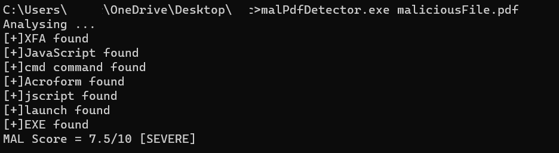

# malPdfDetector
Since AV's cannot detect malicious pdf's, I have created a tool that helps you identify malicious pdf files instantly. Your welcome

## Usage

The pdf-parser.py file and the portable executable must ALWAYS be in the same directory. 

malPdfDetector.exe [maliciousfile.pdf]

The score is generated based on standard deviation from max weightage elements. Max score is assigned based on statistical analysis of various malicious pdf files, understanding the elements that have the capability to execute arbritary code/ other malicious activities. 

